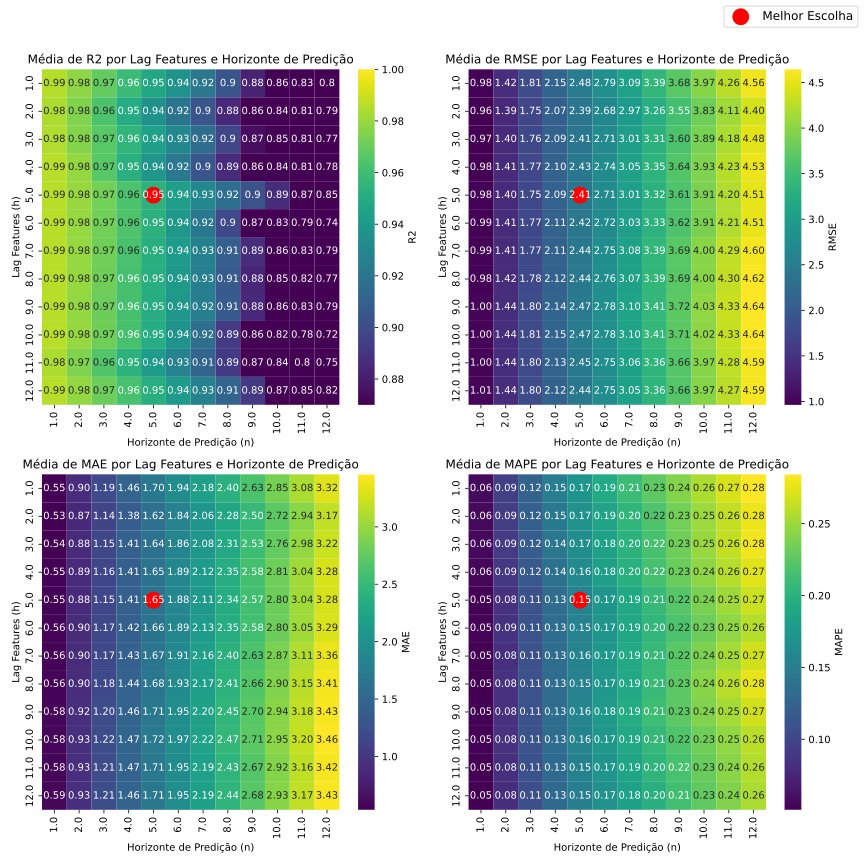

# Análise do Horizonte de Predição e Número Ótimo de Lag Features para o XGBoost

Após identificar o XGBoost com a Configuração 6 de features como o modelo de melhor desempenho, foi conduzido um experimento para determinar o tamanho ótimo do horizonte de predição (`n` períodos futuros) e do número de lag features (`h` períodos passados) a serem utilizados.

## Metodologia

O modelo XGBoost foi treinado e testado com diferentes valores de `h` (número de lag features) e `n` (horizonte de predição), variando de 1 a 12 períodos (onde cada período é de 15 minutos). Foram avaliadas as métricas estatísticas (R², RMSE, MAE, MAPE) e computacionais (tempo de treinamento e inferência).

## Resultados Principais (Conforme Figura 1 do artigo)

* **Número de Lag Features (`h`):**
    * O melhor desempenho foi obtido utilizando entre 1 e 5 períodos de lag features.
    * Utilizar mais de 8 períodos de lag features resultou em uma redução da precisão do modelo.

* **Horizonte de Predição (`n`):**
    * Um horizonte de predição de 5 períodos (equivalente a 1 hora e 15 minutos, pois $\Delta t = 15$ minutos) demonstrou ser o ideal. Este valor proporcionou um bom equilíbrio entre acurácia e estabilidade do modelo.

A figura abaixo apresenta visualmente esses resultados através de heatmaps, e pode ser acessada em [`figure_horizon_lag_optimization.svg`](./results/figure_horizon_lag_optimization.svg).

  
   
  <strong>Heatmaps demonstrando resultados das métricas com relação ao número de Lag Features e tamanho do Horizonte de Predição.</strong>

 

Concluiu-se que a utilização de 5 lag features e um horizonte de predição de 5 períodos ofereceu o melhor balanço entre precisão e estabilidade para o modelo XGBoost na predição da demanda por trocas de baterias.