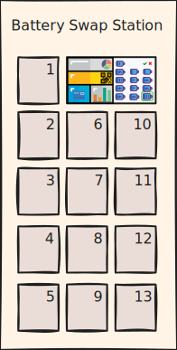

  
   
  <strong>Repositório de Dados: Engenharia de Features e Aprendizado de Máquina para Predição da Demanda em Estações de Troca de Baterias</strong>

 

# Engenharia de Features e Aprendizado de Máquina para Predição da Demanda em Estações de Troca de Baterias (SBAI - 2025)

**Autores:** Juliano L. Moreira, Luciane S. Neves, Aérton Medeiros, Camilo A. S. Rangel  
*Programa de Pós-Graduação em Engenharia Elétrica, Universidade Federal de Santa Maria (UFSM), Santa Maria, RS, Brasil.*

Dados referentes ao artigo aceito no **[Simpósio Brasileiro de Automação Inteligente (SBAI) - 2025](https://sbai.ufsj.edu.br)**.

## 🛵 Sobre este Repositório

Este repositório contém os dados, resultados e materiais suplementares associados ao artigo "Engenharia de Features e Aprendizado de Máquina para Predição da Demanda em Estações de Troca de Baterias", aceito no SBAI - 2025.

**Status Atual:** O artigo encontra-se em processo de revisão.

## 🗂️ Estrutura do Repositório

* **📂 [`1_datasets/`](./1_datasets/)**: Contém os conjuntos de dados pré-processados utilizados no estudo.
    * [`dataset_full_h12.csv`](./1_datasets/dataset_full_h12.csv): Dataset completo com 79.584 registros de 829 BSS's.
    * [`dataset_train_h12.csv`](./1_datasets/dataset_train_h12.csv): Dataset de treinamento (85%) com 67.680 registros de 702 BSS's.
    * [`dataset_test_h12.csv`](./1_datasets/dataset_test_h12.csv): Dataset de teste (15%) com 11.904 registros de 127 BSS's.
    * Consulte o [`README.md`](./1_datasets/README.md) dentro da pasta [`1_datasets`](./1_datasets/) para mais detalhes sobre as features.
* **📂 [`2_case_study_and_results/`](./2_case_study_and_results/)**: Detalhes sobre a configuração experimental e os resultados obtidos.
    * **[`model_configurations_and_features/`](./2_case_study_and_results/model_configurations_and_features/)**: Informações sobre os conjuntos de features testados, hiperparâmetros dos modelos e métricas de desempenho.
        * **[`results/`](./2_case_study_and_results/model_configurations_and_features/results/)**: Contém o arquivo [`result_models_per_config.csv`](./2_case_study_and_results/model_configurations_and_features/results/result_models_per_config.csv) com os resultados obtidos para todas as configurações testadas e modelos.
        * Consulte também os arquivos [`feature_set_configurations.md`](./2_case_study_and_results/model_configurations_and_features/feature_set_configurations.md), [`model_hyperparameters.md`](./2_case_study_and_results/model_configurations_and_features/model_hyperparameters.md), e [`model_performance_results.md`](./2_case_study_and_results/model_configurations_and_features/model_performance_results.md) nesta pasta.
    * **[`prediction_horizon_and_lag_features/`](./2_case_study_and_results/prediction_horizon_and_lag_features/)**: Resultados do estudo para determinar o horizonte de predição e o número ótimo de lag features para o modelo XGBoost.
        * **[`results/`](./2_case_study_and_results/prediction_horizon_and_lag_features/results/)**: Contém a figura [`figure_horizon_lag_optimization.svg`](./2_case_study_and_results/prediction_horizon_and_lag_features/results/figure_horizon_lag_optimization.svg) (Figura 1 do artigo) e os resultados obtidos.
* **📂 [`3_supplementary_material/`](./3_supplementary_material/)**: Contém o [`README.md`](./3_supplementary_material/README.md) com a descrição detalhada de todas as variáveis (features) utilizadas nos datasets e nas métricas.
* **📂 [`4_src/`](./4_src/)**: (Atualmente contém um [`README.md`](./4_src/README.md) explicativo) Esta pasta conterá o código-fonte para pré-processamento, engenharia de features e implementação dos modelos após a publicação do artigo.

## 💬 Como Citar
Após a publicação do artigo, forneceremos a citação completa aqui.
Se você utilizar os datasets ou materiais deste repositório em sua pesquisa, por favor, cite o nosso artigo (detalhes completos serão fornecidos) e este repositório.

**``Artigo`` (Aguardando Publicação):**
Moreira, J. L., Neves, L. S., Medeiros, A., & Rangel, C. A. S. (2025). Engenharia de Features e Aprendizado de Máquina para Predição da Demanda em Estações de Troca de Baterias. *Anais do Simpósio Brasileiro de Automação Inteligente (SBAI)*. (Detalhes a serem confirmados)

**``Este Repositório``:**
Moreira, J. L., Neves, L. S., Medeiros, A., & Rangel, C. A. S. (2025). *Repositório de Dados: Engenharia de Features e Aprendizado de Máquina para Predição da Demanda em Estações de Troca de Baterias*. GitHub. [Link para o repositório]

## ✉️ Contato
Para dúvidas ou mais informações sobre os dados, entre em contato com:
* Juliano L. Moreira: `juliano.moreira@acad.ufsm.br`